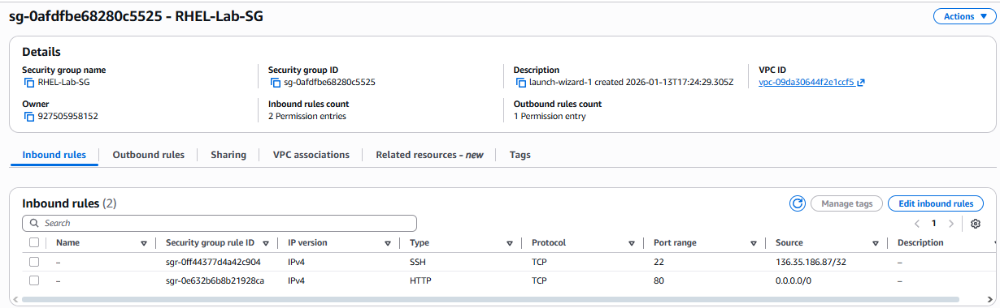

# AWS-RHEL-S3-WebBridge
**Cloud Engineering Portfolio Project**

This project demonstrates a secure bridge between cloud storage and compute resources. I deployed a Red Hat Enterprise Linux (RHEL 9) web server on AWS EC2 and integrated it with Amazon S3 for dynamic content delivery.

## Project Architecture and Milestones
* **Infrastructure:** Provisioned a hardened RHEL 9 instance on AWS EC2.
* **Networking:** Configured custom Security Groups to balance public accessibility with private security.
* **Web Engineering:** Deployed and managed the Apache (httpd) service.
* **Data Integration:** Utilized the AWS CLI to synchronize assets from S3 directly to the server's live web directory.

---

## Technical Verification (Proof of Work)

### 1. Cloud Networking and Security
I configured Inbound Rules to allow Port 80 (HTTP) for public access while keeping Port 22 (SSH) restricted to a specific administrative IP. This proves an understanding of "Least Privilege" security.

### 2. The S3-to-EC2 Bridge
The terminal log below shows the successful synchronization of the index.html file from the S3 bucket to the RHEL web directory. I used the `&&` operator to verify the file was successfully placed on the disk in the same step.

### 3. Service Health and Handshake
I verified the Apache service status using `systemctl` and confirmed a successful `HTTP/1.1 200 OK` handshake using `curl`.

### 4. Final Live Environment
The completed project: A live website serving content directly from secure cloud storage (Bucket: kw21-rhel-logs-2026).

---

## Challenges and Troubleshooting (The DevOps Mindset)
During this project, I encountered and resolved several critical "Connection" errors. Solving these required a deep dive into both AWS Networking and Linux Service management:

* **The Connection Timeout:** Initially, the website would not load. I diagnosed this as a **Security Group** issue where AWS was blocking Port 80. I resolved this by manually authoring an Inbound Rule for HTTP traffic.
* **The Connection Refused (Service Not Found):** After copying my files, the server still wouldn't respond. I discovered the `httpd` package wasn't installed. I resolved this by running `sudo yum install -y httpd` and enabling the service.
* **The S3 403 Forbidden Error:** My initial `aws s3 cp` command failed with a permissions error. I troubleshot the AWS CLI configuration to ensure the instance had the proper authorization to "read" from the specific bucket.

---

## Future Phases
* **Phase 4:** Implementing IAM Roles to replace manual access keys for better security.
* **Phase 5:** Automating the deployment via Terraform.
